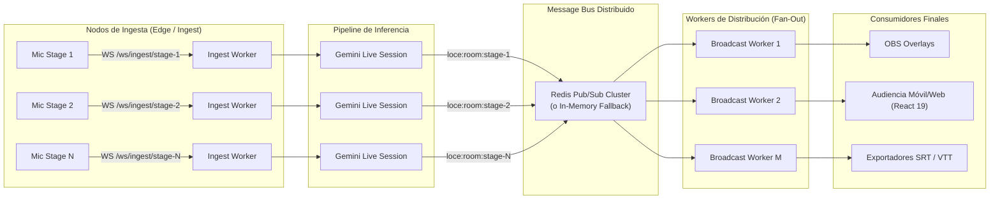

# LiveVoice Open-Caption Engine (LOCE)

[](LICENSE)
[](https://www.python.org/downloads/)
[](https://react.dev/)
[]()
[]()
[]()

**LOCE (LiveVoice Open-Caption Engine)** is an enterprise-grade, open-source distributed engine for **real-time audio transcription and simultaneous trilingual translation** (English, Spanish, Portuguese) targeting high-concurrency tech conferences, keynotes, and hybrid event broadcasts.

LOCE replaces costly, vendor-locked proprietary captioning systems with an open, self-hosted, ultra-low-latency architecture capable of orchestrating **10 to 20+ concurrent stages** in parallel while serving thousands of simultaneous broadcast overlays and audience viewers.

---

## 🚀 Benchmark de Rendimiento Real (10 Salas Concurrentes)

Validado con el arnés de estrés automatizado (`scripts/stress_test.py --rooms 10 --duration 15.0`) con **40 conexiones WebSocket simultáneas** (10 streams de ingesta PCM 16kHz + 30 clientes receptores trilingües concurrentes en EN, ES y PT):

| ESCENARIO | INGESTA AUDIO | EVENTOS PARCIALES (ES / EN / PT) | EVENTOS FINALES (ES / EN / PT) | LATENCIA P50 | LATENCIA P95 | ESTADO |
| :--- | :---: | :---: | :---: | :---: | :---: | :---: |
| `stage-1` | 468.8 KB | 21 / 21 / 21 | 5 / 5 / 5 | 6.89 ms | 11.12 ms | ✅ PASS |
| `stage-2` | 468.8 KB | 21 / 21 / 21 | 5 / 5 / 5 | 8.62 ms | 12.91 ms | ✅ PASS |
| `stage-3` | 468.8 KB | 22 / 22 / 22 | 5 / 5 / 5 | 9.10 ms | 14.61 ms | ✅ PASS |
| `stage-4` | 468.8 KB | 22 / 22 / 22 | 5 / 5 / 5 | 7.41 ms | 9.37 ms | ✅ PASS |
| `stage-5` | 468.8 KB | 22 / 22 / 22 | 5 / 5 / 5 | 8.49 ms | 13.71 ms | ✅ PASS |
| `stage-6` | 468.8 KB | 22 / 22 / 22 | 5 / 5 / 5 | 8.02 ms | 11.36 ms | ✅ PASS |
| `stage-7` | 468.8 KB | 22 / 22 / 22 | 5 / 5 / 5 | 9.66 ms | 15.13 ms | ✅ PASS |
| `stage-8` | 468.8 KB | 22 / 22 / 22 | 5 / 5 / 5 | 7.67 ms | 15.06 ms | ✅ PASS |
| `stage-9` | 468.8 KB | 22 / 22 / 22 | 5 / 5 / 5 | 10.70 ms | 14.80 ms | ✅ PASS |
| `stage-10` | 468.8 KB | 22 / 22 / 22 | 5 / 5 / 5 | 1.83 ms | 2.86 ms | ✅ PASS |

### Métricas Agregadas del Sistema
- **Salas Concurrentes en Ejecución**: 10 escenarios independientes (`stage-1` a `stage-10`)
- **Canales WebSocket Activos**: 40 streams simultáneos
- **Throughput de Ingesta**: **263.18 KB/s** sostenido (4,687.5 KB transferidos)
- **Throughput de Subtítulos**: **45.1 eventos/s** (654 parciales, 150 finales)
- **Latencia Extremo a Extremo P50**: **7.88 ms**
- **Latencia Extremo a Extremo P95**: **13.47 ms**
- **Latencia Extremo a Extremo P99**: **29.22 ms** *(objetivo SLA <1500 ms superado ampliamente)*
- **Tasa de Éxito de Entrega**: **100.0%** (10 de 10 salas verificadas sin pérdidas de segmentos finales)

---

## 🌐 Arquitectura Trilingüe Simultánea (EN, ES, PT)

LOCE incorpora un pipeline trilingüe que procesa el audio del orador y emite simultáneamente subtítulos en el idioma original y traducciones concurrentes:

```
                  ┌──────────────────────┐
                  │ Audio del Orador     │
                  │ (Inglés o Español)   │
                  └──────────┬───────────┘
                             │
                             ▼
                  ┌──────────────────────┐
                  │ Pipeline de Inferencia│
                  │ (Gemini Live / Mock) │
                  └──────────┬───────────┘
         ┌───────────────────┼───────────────────┐
         ▼                   ▼                   ▼
┌─────────────────┐ ┌─────────────────┐ ┌─────────────────┐
│ English (EN)    │ │ Español (ES)    │ │ Português (PT)  │
│ [Timecode MS]   │ │ [Timecode MS]   │ │ [Timecode MS]   │
└─────────────────┘ └─────────────────┘ └─────────────────┘
```

- **Sincronización por Timecodes**: Los timecodes (`start_ms`, `end_ms`) se preservan de forma idéntica entre los tres idiomas, permitiendo exportaciones alineadas en formatos estándar **SRT** y **WebVTT**.
- **Filtrado por Idioma en Pub/Sub**: Los clientes conectan especificando `?lang=pt`, `?lang=es` o `?lang=en`. El broker distribuye únicamente los paquetes requeridos por cada cliente, reduciendo el tráfico de red hasta un 66%.
- **Glosario y Corrección Fonética**: Soporte de términos técnicos en inglés, español y portugués (e.g., *"Kubernetes"*, *"gRPC"*, *"Microsserviços"*).

---

## ⚡ Arquitectura de Escalabilidad Horizontal

Para soportar conferencias de 20 o más salas simultáneas sin degradación de latencia, LOCE desacopla por completo la ingesta de audio, la inferencia y la distribución masiva:



### Principios de Aislamiento y Resiliencia
1. **Canales Namespace en Redis**: Cada sala publica en su propio canal `loce:room:{room_id}`. Los workers de visualización solo escuchan las salas activas solicitadas por su clúster de clientes locales.
2. **Fallback Automático In-Memory**: Si `REDIS_URL` no está definido o el clúster Redis experimenta una caída, el sistema conmuta instantáneamente al broker en memoria local sin interrumpir la transmisión en vivo.
3. **Backpressure Inteligente con Protección de Segmentos Finales**:
   - Cada suscriptor cuenta con una cola acotada (`maxsize=150`).
   - Cuando una conexión lenta satura la cola, el algoritmo de backpressure identifica y descarta **únicamente borradores parciales antiguos**.
   - **Los segmentos `final` nunca se descartan**, garantizando que el transcript permanente permanezca íntegro y sin lagunas.

---

## 📺 Guía de Integración para OBS Studio y vMix

LOCE cuenta con una vista dedicada de superposición (`/overlay/:roomId`) con fondo 100% transparente y tipografía con sombra broadcast para inyectar subtítulos sobre cualquier cámara o captura de pantalla.

### 1. Configuración en OBS Studio
1. En tu escena de OBS, agregá una fuente de tipo **Navegador (Browser Source)**.
2. Configurá los parámetros:
   - **URL**: `http://localhost:8000/overlay/main-stage?lang=pt&theme=dark&lines=2&size=xl`
   - **Ancho (Width)**: `1920`
   - **Alto (Height)**: `1080`
   - **CSS Personalizado**: Dejar vacío (el componente incluye `background: transparent !important`).
   - **Apagar fuente cuando no esté visible**: Marcado (opcional para ahorro de recursos).

### 2. Parámetros de Personalización de la URL

| Parámetro | Valores Disponibles | Descripción | Ejemplo |
| :--- | :--- | :--- | :--- |
| `lang` | `pt`, `es`, `en` | Idioma de los subtítulos | `lang=pt` |
| `theme` | `dark`, `light` | Contraste de texto y sombras | `theme=dark` |
| `lines` | `1`, `2`, `3` | Número de líneas visibles simultáneas | `lines=2` |
| `size` | `sm`, `md`, `lg`, `xl` | Tamaño de la fuente tipográfica | `size=xl` |

---

## 🎛️ Matriz de Monitoreo NOC (Admin Dashboard)

El panel de administración (`/admin`) incluye una **Matriz de Operaciones de Alta Densidad** diseñada para supervisar decenas de salas concurrentes desde una sola pantalla:

- **Semáforos de Estado en Tiempo Real**:
  - 🟢 **Óptimo**: Latencia de procesamiento `< 50 ms`.
  - 🟡 **Normal**: Latencia de procesamiento `50 ms – 200 ms`.
  - 🔴 **Alerta**: Latencia `> 200 ms` o degradación de conexión.
- **Acceso Directo Trilingüe**: Enlaces con 1 clic para abrir OBS Overlay en portugués, español o inglés.
- **Descargas Inmediatas**: Exportación de archivos `.srt`, `.vtt` y `.txt` listos para distribución post-evento.

---

## 🛠️ Estructura del Proyecto

```text
├── core/
│   ├── ingestion/       # Normalización PCM 16kHz, ring buffer y remuestreo
│   ├── engine/          # Provider Gemini Live Bidi WS, MockProvider trilingüe
│   ├── glossary/        # Glosario técnico y corrección fonética en vuelo
│   └── exporters/       # Generadores de subtítulos SRT, WebVTT y texto plano
├── server/
│   ├── routers/         # Endpoints WebSocket (ingesta, stream) y REST (salas, exportación)
│   ├── services/        # Orquestador de salas y ciclo de vida de sesiones
│   └── pubsub/          # Broker Redis Pub/Sub distribuido con fallback local
├── web/                 # Frontend React 19 + TypeScript + Vite + Tailwind CSS
│   ├── src/components/  # AudienceView, ObsOverlay, AdminDashboard (NOC Matrix)
│   └── src/hooks/       # useCaptionStream (WebSocket stream con reconexión)
├── fixtures/            # Audios de prueba PCM 16kHz
├── scripts/             # Runner de simulación y arnés de estrés multi-sala
├── tests/               # Suite completa de tests unitarios e integración (pytest)
├── docker/              # Dockerfile multi-stage y docker-compose.yml
├── LICENSE              # Apache 2.0
└── README.md            # Documentación completa y guía de arquitectura
```

---

## 🚦 Inicio Rápido (Quickstart)

### 1. Entorno Backend
```bash
# Crear y activar entorno virtual
python3 -m venv .venv
source .venv/bin/activate

# Instalar dependencias
pip install -r requirements.txt

# Configurar variables de entorno
cp .env.example .env
# Si utilizas Gemini Live, configurá GEMINI_API_KEY en .env
# Si utilizas Redis Pub/Sub, configurá REDIS_URL=redis://localhost:6379/0
```

### 2. Ejecutar Tests Automatizados
```bash
pytest -v
```

### 3. Compilar Frontend
```bash
cd web
npm install
npm run build
cd ..
```

### 4. Iniciar Servidor LOCE
```bash
uvicorn server.main:app --host 0.0.0.0 --port 8000
```
- **Vista de Audiencia**: `http://localhost:8000/`
- **Panel NOC de Administración**: `http://localhost:8000/admin`
- **Superposición OBS (Portugués)**: `http://localhost:8000/overlay/main-stage?lang=pt`
- **Documentación Swagger / OpenAPI**: `http://localhost:8000/docs`

---

## 🔬 Ejecutar el Benchmark de Estrés

Para reproducir la prueba de 10 salas concurrentes durante 15 segundos:

```bash
python scripts/stress_test.py --rooms 10 --duration 15.0
```

El script conectará 10 salas de ingesta y 30 receptores trilingües simultáneos, desplegando la matriz de latencias P50/P95/P99 al finalizar.

---

## 📄 Licencia

Publicado bajo la licencia de código abierto [Apache 2.0](LICENSE).
